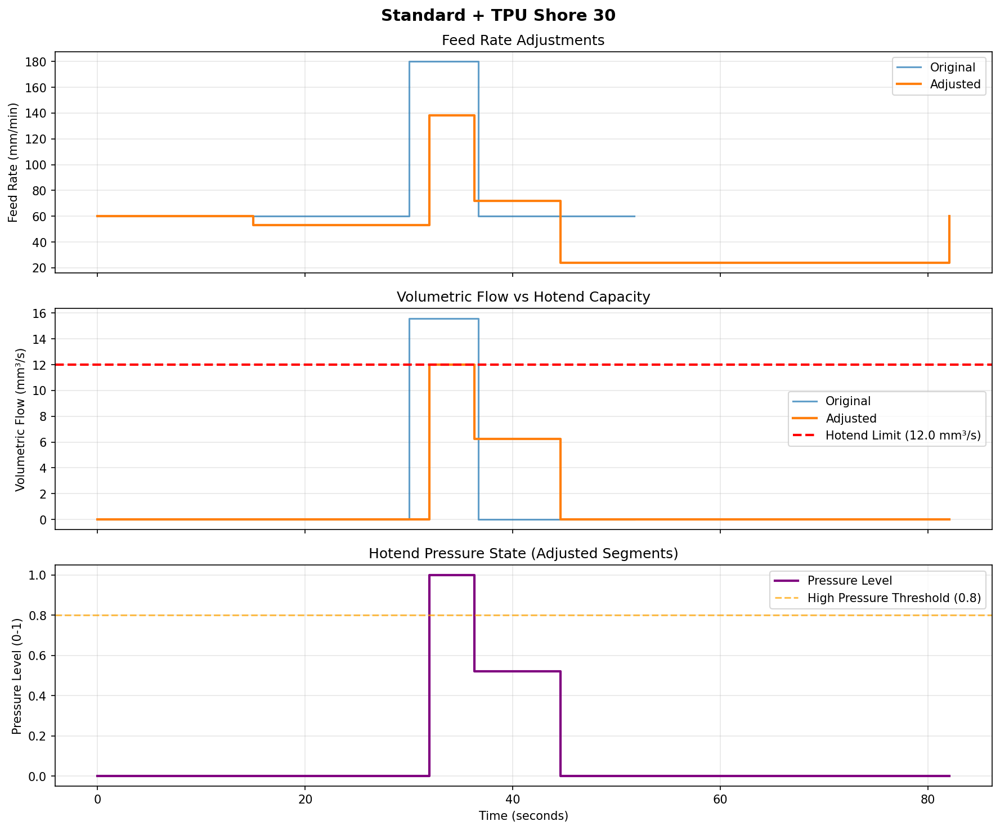
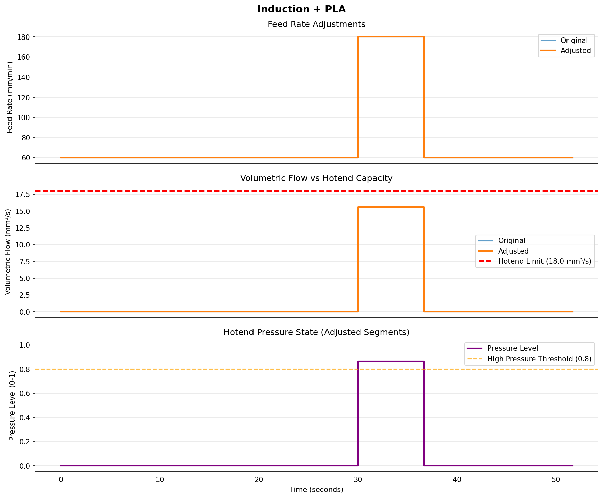
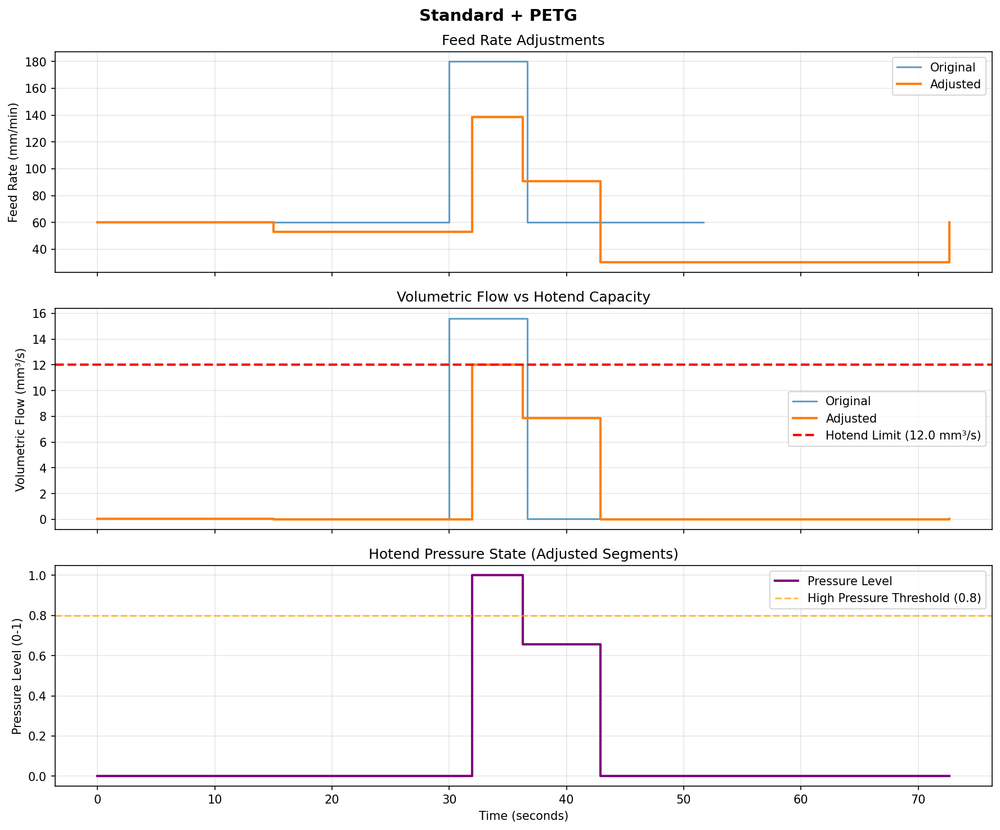
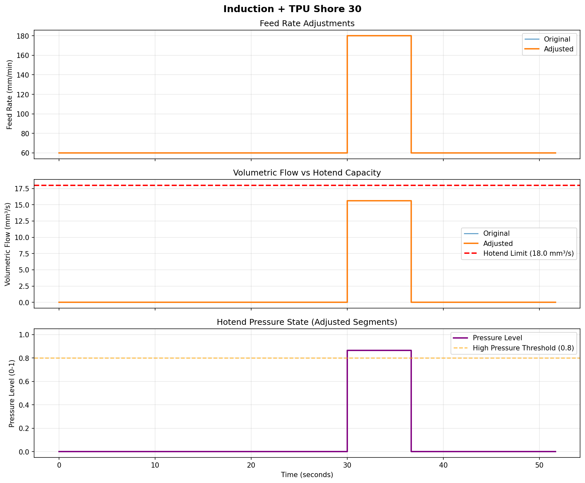

# Advanced Examples

Advanced examples exploring different configurations and comparing compensation behavior.

## custom_hotend.py

**What it demonstrates:**
- Using predefined hotend profiles (Standard, Fast Response, Induction)
- Testing different materials (PLA, PETG, TPU variants)
- Comparing how equipment and material choices affect compensation
- Understanding the combined effect of hotend speed and material softness

**Scenarios tested:**

### Scenario 1: WORST CASE (Maximum Compensation)
- **Hotend**: Standard (12 mm³/s, 80ms response)
- **Material**: TPU Shore 30 (very soft)
- **Result**: Aggressive compensation (~2.5x factor)
- **Plot**: `custom_hotend_standard_tpu_shore_30.png`



### Scenario 2: BEST CASE (Minimal Compensation)
- **Hotend**: Induction (18 mm³/s, 10ms response)
- **Material**: PLA (Shore 75, rigid)
- **Result**: Minimal compensation (~0.2x factor)
- **Plot**: `custom_hotend_induction_pla.png`



### Scenario 3: MID-RANGE (Moderate Compensation)
- **Hotend**: Standard (12 mm³/s, 80ms response)
- **Material**: PETG (Shore 70)
- **Result**: Moderate compensation (~1.8x factor)
- **Plot**: `custom_hotend_standard_petg.png`



### Scenario 4: FAST HOTEND + SOFT MATERIAL
- **Hotend**: Induction (18 mm³/s, 10ms response)
- **Material**: TPU Shore 30 (very soft)
- **Result**: Material compensation, but fast hotend reduces it
- **Plot**: `custom_hotend_induction_tpu_shore_30.png`



**Run it:**
```bash
# From project root
uv run python examples/advanced/custom_hotend.py

# Or
cd examples/advanced
uv run python custom_hotend.py
```

**Output:**
- Console: Detailed comparison table for each scenario
- Plots: 4 PNG files (one per scenario)

## Key Insights

**Material Matters:**
- Shore 30 (soft TPU): Slow pressure decay → long recovery time
- Shore 75 (PLA): Fast pressure stabilization → minimal compensation
- Difference: Up to 2.5x in compensation factor

**Hotend Speed Matters:**
- Standard (80ms): Slow response → more preemptive slowdown
- Induction (10ms): Fast response → minimal adjustments
- Difference: Up to 8x faster recovery

**Combined Effect Formula:**
```python
compensation = (hotend.response_time / 0.05s) × material_factor
material_factor = 1.0 + (1.0 - shore_hardness/100) × 0.8
```

**Example calculations:**
- Standard + Shore 30: (0.08/0.05) × 1.56 = **2.5x** compensation
- Induction + PLA: (0.01/0.05) × 1.2 = **0.24x** compensation
