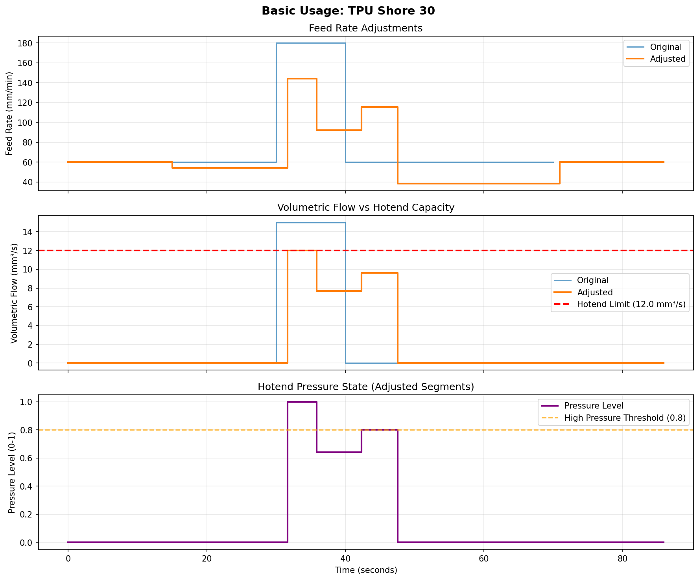

# Basic Examples

Simple introductory examples demonstrating core functionality of the extrusion planner.

## basic_usage.py

**What it demonstrates:**
- Creating segments with realistic perimeter-to-infill transition
- Setting up hotend and material configurations
- Processing segments through the planner
- Viewing before/after adjustments
- Automatic plot generation

**Scenario:**
- 8 segments: slow perimeter → fast infill → back to perimeter
- Hotend: Standard (12 mm³/s, 50ms response)
- Material: TPU Shore 30 (soft)
- Peak flow: 15 mm³/s (exceeds hotend limit!)

**Run it:**
```bash
# From project root
uv run python examples/basic/basic_usage.py

# Or
cd examples/basic
uv run python basic_usage.py
```

**Output:**
- Console: Segment-by-segment adjustments with percentages
- Plot: `basic_usage_plot.png` (3-panel comparison)



**Expected results:**
- 5/8 segments adjusted (62.5%)
- Preemptive slowdown before high-flow segments
- Pressure compensation after high-flow region
- All flow stays within 12 mm³/s limit

## Understanding the Output

**Console Output:**
```
================================================================================
BASIC EXTRUSION PLANNER USAGE
================================================================================

Input Configuration:
  Hotend: 12.0 mm³/s max flow, 50ms response
  Material: TPU Shore 30 (Shore 30)
  Segments: 8 moves to process

Original Segments:
  #    Length     Feed Rate    Extrusion    Flow Rate
       (mm)       (mm/min)     (mm³)        (mm³/s)
  ----------------------------------------------------------------------
  0    15.0       60.0         0.30         0.02
  1    15.0       60.0         0.30         0.02
  2    10.0       180.0        50.00        15.00
  3    10.0       180.0        50.00        15.00
  4    10.0       180.0        50.00        15.00
  5    15.0       60.0         0.30         0.02
  6    15.0       60.0         0.30         0.02
  7    15.0       60.0         0.30         0.02

Processing segments...
Done!

Adjusted Segments:
  #    Length     Feed Rate    Extrusion    Flow Rate
       (mm)       (mm/min)     (mm³)        (mm³/s)
  ----------------------------------------------------------------------
  0    15.0       60.0         0.30         0.02
  1    15.0       54.0         0.30         0.02
  2    10.0       144.0        50.00        12.00
  3    10.0       92.3         50.00        7.69
  4    10.0       115.4        50.00        9.62
  5    15.0       38.5         0.30         0.01
  6    15.0       60.0         0.30         0.02
  7    15.0       60.0         0.30         0.02

Adjustments Summary:
  ----------------------------------------------------------------------
  Segment 1: 60.0 -> 54.0 mm/min (10.0% reduction)
  Segment 2: 180.0 -> 144.0 mm/min (20.0% reduction)
  Segment 3: 180.0 -> 92.3 mm/min (48.7% reduction)
  Segment 4: 180.0 -> 115.4 mm/min (35.9% reduction)
  Segment 5: 60.0 -> 38.5 mm/min (35.9% reduction)

Total segments adjusted: 5/8

================================================================================
GENERATING PLOT
================================================================================
  Plot saved: basic_usage_plot.png
```

**Plot Panels:**
1. **Feed Rate**: Original vs adjusted feed rates over time
2. **Volumetric Flow**: Flow rates vs hotend capacity limit (red line)
3. **Pressure Level**: Internal pressure state (0.0-1.0) and compensation threshold

**Key Insight:** The planner applies 3-stage protection:
1. Preemptive slowdown (segments 1-4)
2. Pressure compensation (segment 5)
3. Safety limits (all segments capped at 12 mm³/s)

